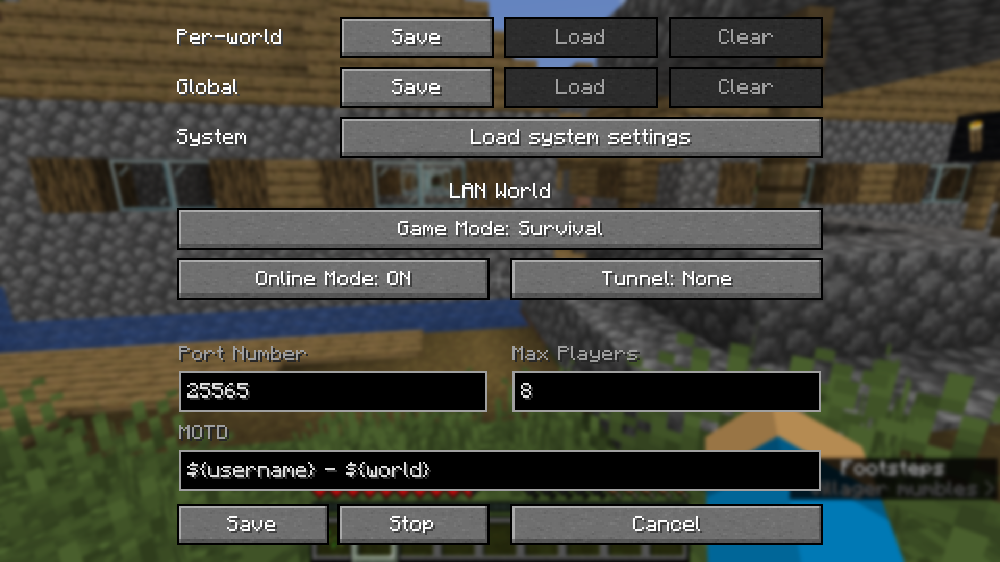
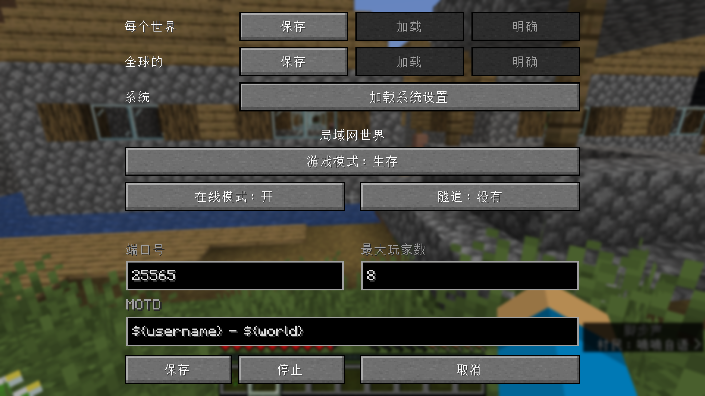

# Auto-Lan


**Info:**
* This mod's codes are inspired by [Custom-LAN](https://github.com/DimiDimit/Custom-LAN)

**Functions:**
* Customize more of your integrated server (Online Mode, Max Players, MOTD)
* Use ampersands (`&`) for [formatting codes](https://minecraft.wiki/w/Formatting_codes) instead of section signs (`§`) and variables (e.g. `${username}`, `${world}`) in the MOTD
* Change the settings mid-game (including the port) and stop the server without quitting the world
* Save the settings globally or per-world (they are loaded automatically with per-world settings taking priority over the global ones, which take priority over the system defaults)
* Change who can use cheats individually using the `/op` and `/deop` commands and cheat in singleplayer without opening to LAN (replaces the Allow Cheats button)
* Manage bans with `/ban`, `/ban-ip`, `/banlist`, `/pardon` and `/pardon-ip`, and whitelist players with `/whitelist` (use `/whitelist on`/`off` to enable/disable)
* Expose your server outside your LAN without port forwarding using tunnels (currently only ngrok is supported)

Commands:
```
/publish [port] [onlineMode] [maxPlayers] [defaultGameMode] [tunnel] [motd]
/publish [perworld|global|system] [port] [onlineMode] [maxPlayers] [defaultGameMode] [tunnel] [motd]
/publish stop
```
The global settings are stored in `.minecraft/config/autolan.toml`, while the per-world ones are stored in `data/autolan.dat` in the respective world's directory.

The files used are also per-world and the same as on dedicated servers—`banned-players.json`, `banned-ips.json`, `whitelist.json`—though whether the whitelist is enabled is stored in `data/autolan.dat`.
